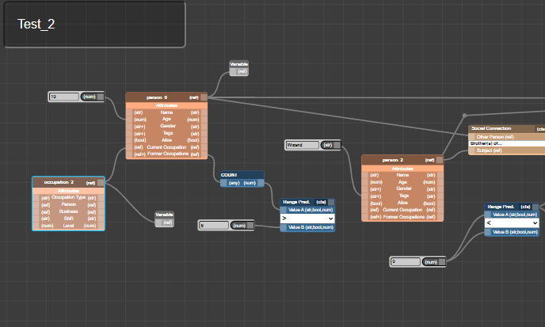

Centrifuge is a cross-platform visual scripting tool for authoring story sifting patterns.
It is intended to be used with character-based social simulations where a large number of
characters interact, form relationships, experience life events, and hold various roles.

Sifting patterns search the state of the simulation, looking for matching characters, events,
and scenarios. Our goal with Centrifuge was to develop a tool that enables users to craft
sifting patterns without worrying about low-level query language syntax.

Centrifuge is built on [DataScript](https://github.com/tonsky/datascript), an open-source
in-memory database and datalog-based query language. Users drag-and-drop nodes that correspond
to parts of DataScript's query syntax, and Centrifuge takes care of translating their pattern
of nodes into a valid query.

The current version of Centrifuge is configured for use with the [_Talk of the Town_](https://github.com/james-owen-ryan/talktown)
simulationist story generator. _Talk of the Town_ was the simulation back-end for the
award-winning augmented reality live-acting game, [_Bad News_](https://users.soe.ucsc.edu/~jor/publications/samuelBadNews.pdf).
We chose this simulation because in _Bad News_, one player acts as the _Wizard_.
Their job is to find interesting characters in the simulation by manually coding inside a
Python interpreter. This manual story sifting is a tedious process and requires knowledge of
python programming and the internal simulation structure. Here is an example
[video](https://www.youtube.com/watch?v=NUnp44OkaQo) of gameplay.

## Links

- [GitHub Repo](https://github.com/ShiJbey/centrifuge)
