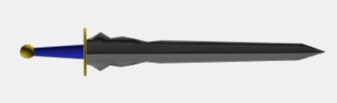

I started this project in 2016 as an effort to learn more about
procedural content generation and computer graphics.
The then-upcoming release of No Man's Sky and my interest
in blacksmithing inspired me to pursue this. My goal was to
submit it to the r/proceduralgeneration subreddit challenge
linked below. Since then, I have continuously tinkered with
this project in my free time. Infiniforge is a NodeJs server
that exports 3D meshes (using ThreeJs) as glTF JSON via a REST API.
After exporting the models, they can then be imported into Unity or
any other software that supports the glTF format.

### Links

- [Github Repo](https://github.com/ShiJbey/Infiniforge)
- [Reddit Monthly PCG Challenge Aug 2016](https://www.reddit.com/r/proceduralgeneration/comments/4wubjy/monthly_challenge_9_august_2016_procedural_weapons/)
