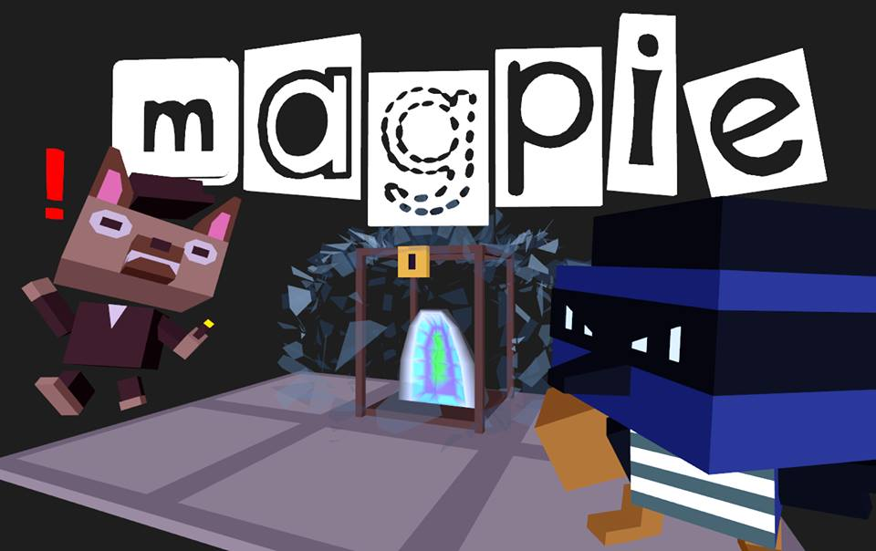

This was the final project for my Fall 2018 15-466: Computer Game Programming course.
I worked on a team with three other students where my primary role was to write the
code which imported our 3D assets, built the level, and instanced characters/animations.
In the game, you play a Magpie bird who is stealing items from a museum. How many items
can you steal before you're caught by security?

### Links

- [Game download](https://github.com/ShiJbey/Magpie/releases/tag/0.2.0)
- [Github Repo](https://github.com/ShiJbey/Magpie)
