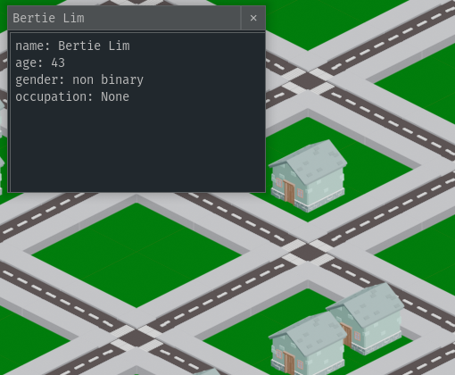

## What exactly is Neighborly?

Neighborly is a framework for procedurally generating towns of characters. You can think
of it as something similar to the world generation phase of *Dwarf Fortress* or the planet
generation in *No Man's Sky*. It simulates
the lives of each character, their jobs, routines, relationships, and life events. Neighborly utilizes
an entity-component system architecture, and enables users to specify custom character types, businesses,
occupations, life events, and AI components and simulation systems. Neighborly has
gone through many phases and has suffered its fair share of feature creep. It started off as a refactor of
[*Talk of the Town*](https://github.com/james-owen-ryan/talktown), but it quickly grew into
much more as a I started replacing various bits of code and pulling out the major parts
that I wanted to keep.

## What is the current status of Neighborly?

The build available on [PyPI](https://pypi.org/project/neighborly/) (0.9.0) is broken. I made that
release to reserve the name. I planned on having a fully functional version by the spring time, but
it is currently summer 2022 and a 1.0.0 release is nowhere in sight.

## What is neighborly for?

Neighborly does not have an experience that it targets. I have gone back and forth between many
different game genres, but I have not found anything that quite fits. NEighborly sits somewhere
between a character-focused city-builder and a life simulator game. At one point I have considered
both these genres as potential targets. Currently, life simulator seems to be the easiest to
create a GUI for. However, the life simulator hides all the interesting life stories of the other
characters in the town. Another potential direction is to let people generate towns and read the
transcripts of events that have transpired between visits.

Neighborly is a social simulation engine for procedurally generating towns of characters.

## Links

- [GitHub Repo](https://github.com/ShiJbey/neighborly)
