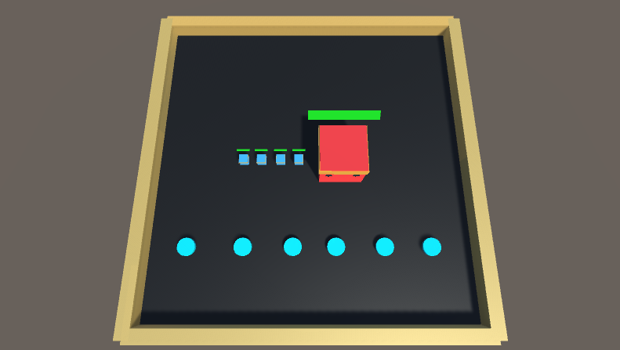

**This Project is archived and not in progress**

Inspired by my enjoyment of raids in games like Destiny, I started
working on this project during my free time. The goal is to train
AI agents to work as a team to defeat a boss character in an
MMORPG-style Raid battle. This project is my first exploration into
cooperative multi-agent machine learning (MARL). There are two components
to this project that interest me the most. The first is teaching the
team of agents to cooperate based on their role on the team (RPG class).
The second is teaching the large boss character to attack enemies and
efficiently defend themselves from multiple attackers. I think raids are
ideal environments for teaching intelligent agents cooperation and
role-playing skills. I see MMORPGs taking advantage of a system like this
to produce better companion AI. Currently, this project is very much a work
in progress as I am still designing the environment. If this project proves
successful, I would like to expand the results to a published game. I am not
working on this at the moment. One day I'll revisit and finish.

### Links

- [Github Repo](https://github.com/ShiJbey/RaidAI)
