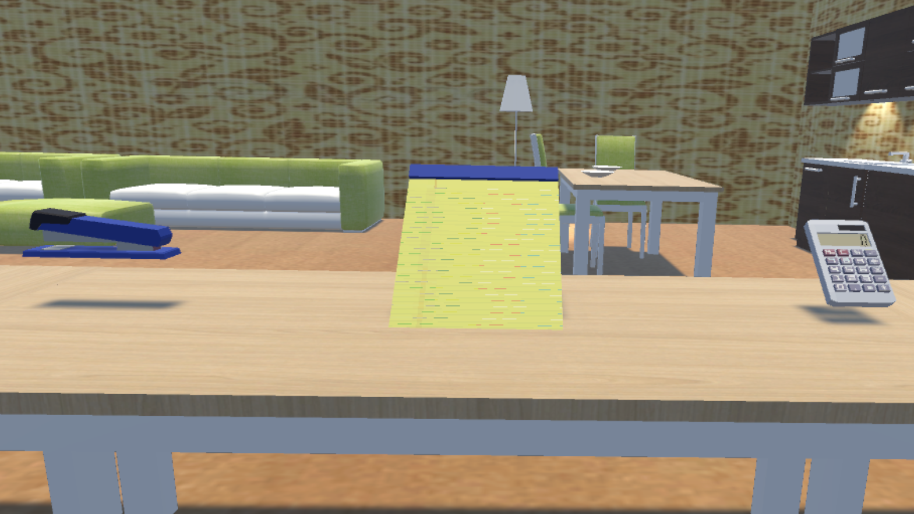

This was my masters research project. The goal was to explore the use of an auditory
P300 BCI paradigm for enabling users to select objects in virtual reality.
What I ended with was an EEG-hardware agnostic Unity project that could be
configured to run different P300 paradigms in virtual reality. The while running the
unity scene EEG data is streamed from the headset and written out to files to be
processed. For example, one can take recorded EEG data using a machine learning
classifier to make predictions as to what object the user wants to select. Pictured is
the virtual apartment environment with three objects used during testing.

### Links

- [View Thesis](/publications/Event_Related_Potentials_for_Virtual_Reality_Interactions.pdf)
- [Github Repo](https://github.com/ShiJbey/AudioERP)
